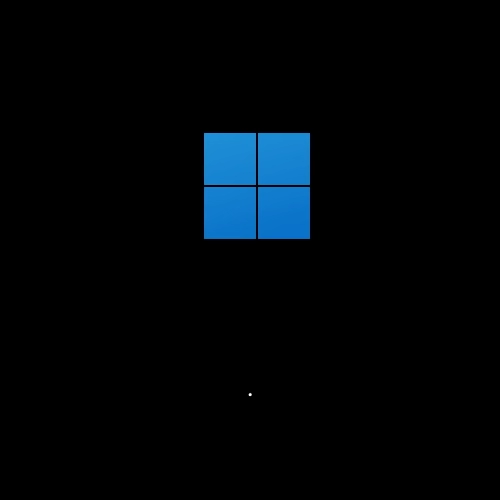
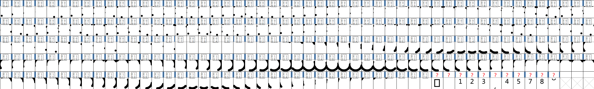

# Open Windows Loading Animation

## Preface

This project aims to *faithfully reinterpret* the Windows 8 / 10 (Metro style) and 11 (Fluent style) loading animations independently.

> **Warning: These are not 1:1 replicas, but rather independent recreations inspired by their aesthetics and visual style.**

P.S. Just found out that there is actually a terminology for loading animation / loading bar / that spinny circling thing, *throbber*. But come on, nobody uses that word.

Personally, as someone who is absolutely horrendous at designing stuff, I have always been fascinated by Windows' boot animations. These are the two animations that inspired this project:

<table align="center">
  <tr>
    <td align="center">
       
      Windows 8 Boot Animation
    </td>
    <td align="center">
       
      Windows 11 Boot Animation
    </td>
  </tr>
</table>

In case you don't know, these two loading animations can be extracted from a font file called *Segoe Boot Semilight*, located at:

 `%SystemDrive%\Windows\Boot\Fonts\segoe_slboot.ttf`

In version **1.40**, the animations are stored as individual vector frames in the [Unicode Private Use Area](https://en.wikipedia.org/wiki/Private_Use_Areas).

P.S. Using a font's Private Use Area to store icons or other vector graphics is actually a fairly common optimization technique, and can also be found in websites and some games.

  

However, you cannot simply copy and redistribute that font file with your project, as it is copyrighted and licensed by Microsoft.

So, this is where this project comes in.

## What This Project Offers

This project provides independently created loading animations inspired by Windows' Metro and Fluent design languages.

The project includes the Metro (2 variations) and Fluent-style animations in the following formats:

- Lottie JSON (30 / 60 fps)

- Lottie dotLottie (30 / 60 fps)

- TTF (30 / 60 fps)

- OTF (30 / 60 fps)

- WOFF2 OTF (30 / 60 fps)

- Animated WebP Lossless ARGB8888 (30 / 60 fps) x (2048x2048 / 1024x1024 / 512x512 / 256x256 / 128x128 / 64x64 / 32x32 / 16x16)

- Animated PNG Lossless ARGB8888 (30 / 60 fps) x (2048x2048 / 1024x1024 / 512x512 / 256x256 / 128x128 / 64x64 / 32x32 / 16x16)

This project also includes:

- [A Unicode code point player demo page (generated by Claude)](https://snnyyp.github.io/open-windows-loading-animation/unicode_code_point_player.html)

- After Effects 25.3.2 project file, which created all the above animations and were exported with [Bodymovin](https://aescripts.com/bodymovin/) plugin. You can tweak the AE project in any way you like to suit your needs.

All animations are intended to be **EXACTLY 5 seconds** in duration.

## Animation Demonstration (Animated WebP 256x256 60FPS)

<table align="center">
  <tr>
    <td align="center">
       
      Fluent11
    </td>
    <td align="center">
       
      Metro8
    </td>
    <td align="center">
       
      Metro8 Infinite
    </td>
  </tr>
</table>

## A Note For Font File Users

All vector frames are stored in the Unicode Private Use Area.

All font files use a **2048 EM** square.

- 30FPS: U+E000 - U+E095 (150 frames)

- Whole bundle 30FPS (OWLA-30FPS.*, 3 x 150 = 450 frames)

  |      Style      | Range Start | Range End |
  | :-------------: | :---------: | :-------: |
  |    Fluent11     |   U+E000    |  U+E095   |
  |     Metro8      |   U+E096    |  U+E12B   |
  | Metro8 Infinite |   U+E12C    |  U+E1C1   |  

- 60FPS: U+E000 - U+E12B (300 frames)

- Whole bundle 60FPS (OWLA-60FPS.*, 3 x 300 = 900 frames)

 |      Style      | Range Start | Range End |
 | :-------------: | :---------: | :-------: |
 |    Fluent11     |   U+E000    |  U+E12B   |
 |     Metro8      |   U+E12C    |  U+E257   |
 | Metro8 Infinite |   U+E258    |  U+E383   |

## Special Thanks

- [FontForge](https://fontforge.org/) - for font generation and export.
- [LottieTools.app](https://lottietools.app/) - for various extremely useful Lottie tools. More importantly, it requires no login and does not upload files to a server.
- [Lottielab](https://www.lottielab.com/lottie/lottie-to-dotlottie) - for converting Lottie JSON files to Lottie dotLottie. For some reason, the dotLottie files converted by LottieTools.app were significantly larger than their JSON counterparts. In theory, dotLottie is animation JSON + meta info wrapped in a ZIP. The animation and meta info JSON are less then 10KB combined, how could the final dotLottie be over 100KB? Seriously! ZIP files don't have that much overhead, I'm pretty sure about that. But I don't have time to dig into, so I used Lottielab instead.

## Licenses

### Fonts

The fonts in `OTF/`, `TTF/`, and `WOFF2 OTF/` are licensed under the [SIL Open Font License 1.1](LICENSES/OFL.txt)

### Source Code

The source code and scripts in this repository are licensed under the [BSD Zero Clause License](LICENSES/0BSD.txt)

### Animation Assets

The animation assets, including files in `Animated PNG/`, `Animated WebP/`, `Lottie JSON/`, `Lottie dotLottie/`, and the After Effects project are licensed under the [Creative Commons Attribution 4.0 International License (CC BY 4.0)](LICENSES/CC-BY-4.0.txt)

## Trademark and Copyright Notice

Windows, Microsoft, Segoe, and other Microsoft product or font names mentioned in this repository are trademarks or copyrighted materials of Microsoft Corporation.

This project is an independent recreation inspired by the visual style of Windows loading animations. It is **not affiliated with, endorsed by, or sponsored by Microsoft**.

The original Microsoft *Segoe Boot Semilight* font and its associated assets are not included in this repository.

The names of Microsoft products and fonts are used solely for identification and descriptive purposes.
